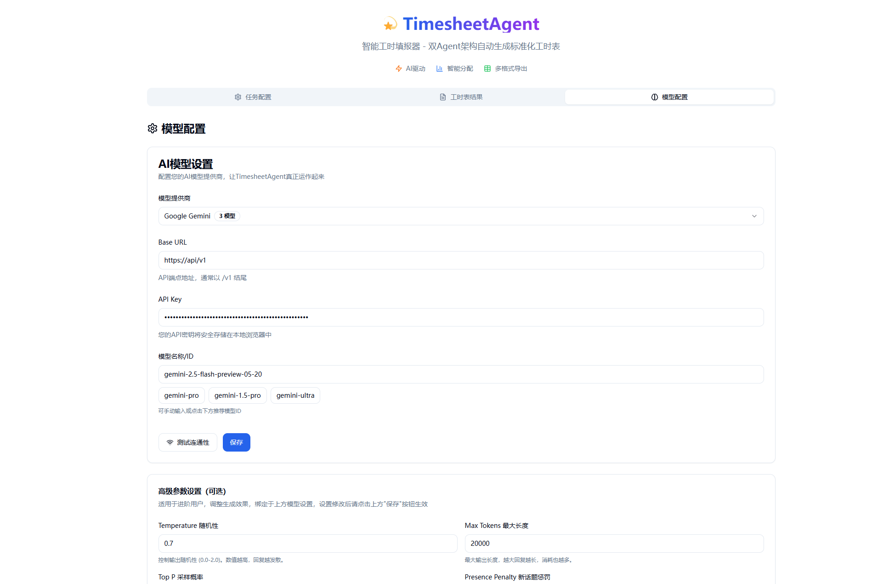
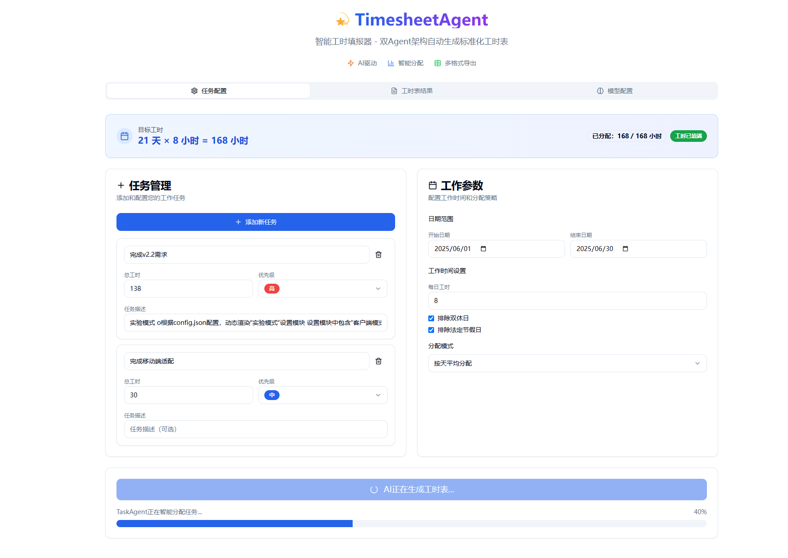
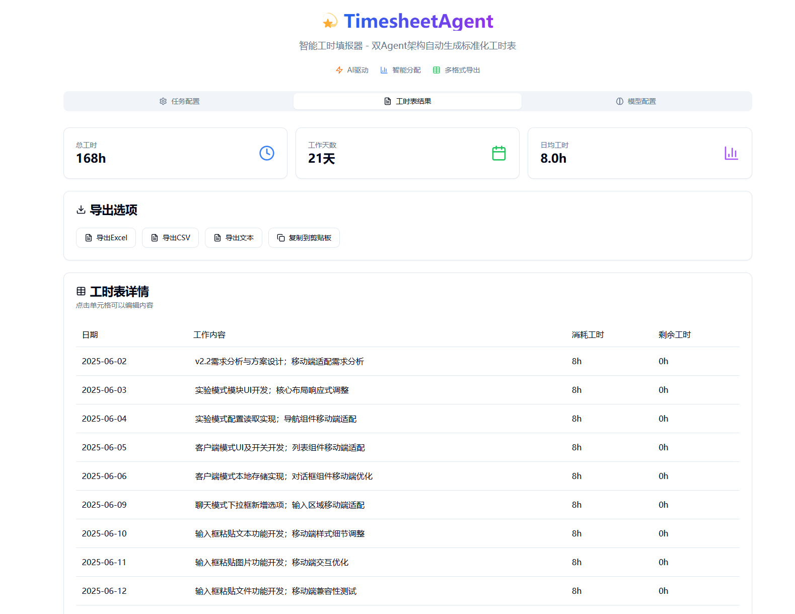

<h1 align="center">TimesheetAgent 智能工时填报器</h1>

<div align="center">
  
  <p>让工时填报变得智能而高效</p>
</div>

[](https://github.com/pengpen1/timesheet-agent)


## 📸 界面预览

<div align="center">
  <p><strong>配置页面</strong> - 支持多模型配置</p>
  
</div>
<div align="center">
  <p><strong>任务页面</strong> - 智能任务分配</p>
  
</div>
<div align="center">
  <p><strong>结果页面</strong> - 专业工时生成</p>
  
</div>

## ✨ 特性

- 🤖 **AI 驱动**：集成 OpenAI、Moonshot、智谱 AI 等多种模型
- 🎯 **双 Agent 架构**：TaskAgent 任务分配 + TimesheetAgent 工时生成
- 📊 **多种策略**：按天平均/按优先级/按功能模块分配
- 📁 **灵活导出**：支持 Excel、CSV、文本格式和一键复制
- 🎨 **现代设计**：基于 shadcn/ui + Tailwind v4，支持深色模式
- 💾 **本地存储**：自动保存配置和历史记录

## 🚀 快速开始

### 环境要求

- Node.js 18.17+
- npm/yarn/pnpm

### 安装运行

```bash
# 安装依赖
pnpm install

# 开发模式
pnpm dev

# 生产构建
pnpm build
pnpm start
```

访问 [http://localhost:3001](http://localhost:3001) 开始使用

## 📖 使用指南

### 1. 配置模型（必需）

- 选择模型提供商（OpenAI/Moonshot/智谱 AI）
- 填写 API 配置并测试连通性
- 保存配置

### 2. 配置任务

- 添加任务（名称/工时/优先级/描述）
- 设置日期范围和每日工时
- 选择分配策略

### 3. 生成工时表

- 点击"生成智能工时表"
- AI 自动生成专业描述
- 支持实时编辑和导出

## ⚙️ 技术栈

| 类型 | 技术       | 版本  |
| ---- | ---------- | ----- |
| 框架 | Next.js    | 15.0+ |
| 样式 | Tailwind   | 4.1+  |
| 状态 | Zustand    | 4.4+  |
| 类型 | TypeScript | 5.0+  |
| UI   | shadcn/ui  | 最新  |

## 📁 目录结构

```
timesheetagent/
├── app/                    # Next.js App Router
├── components/            # UI 组件
│   └── ui/               # 基础组件
├── lib/                  # 核心逻辑
│   ├── agents/          # AI 智能体
│   ├── utils.ts         # 工具函数
│   └── export.ts        # 导出模块
└── public/              # 静态资源
```

## 🔜 开发计划

- [x] 支持自定义模型配置
- [x] 支持第三方大模型
- [x] 支持图片/文件输入
- [ ] 自动拉取 git 日志
- [ ] 自动化填报功能

## 📄 许可证

ISC License © 2024

---

<div align="center">
  <strong>TimesheetAgent</strong><br>
  <sub>基于 AI 的下一代工时填报解决方案</sub>
</div>
